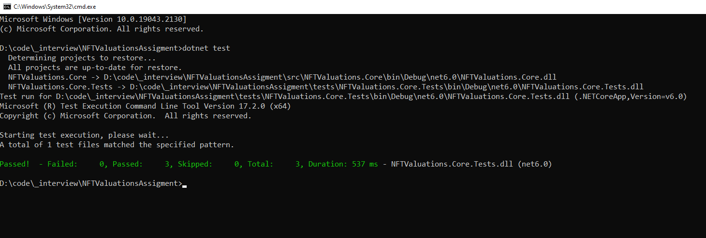

# NFTValuationsBackend Coding Challenge

If you are reading this, you most probably have been asked to complete this assessment as part of NFTValuations Technical challenge on interview process.

In this repository, you will find the base project and instructions on what to do with them. 

## How to complete this test

Please follow the instructions in the **docs\NFTValuations_CS_Technical_Question.pdf**, found in this repository

Please explain the work that you did or any challenges that you faced, either by comments in code or in an email. 
In case the requirements are not met or they are not finished please explain the reasoning behind that.

## How to submit your completed test

 Please write your solutions as per the instructions in the file and send it back to the recruiter. 
 You can send it back any time within a week. 
 Please do not create a public github repository as we will like to keep other candidates from copying your solutions.

## Goal
 With this exercise we would like to understand how you would think about and solve a task for production at any given day. 


## Todo
- [X] Parse Input
- [X] Token URI + Smart Contract Interaction
- [X] Processing Token URI + Output
- [ ] Add Tests
- [ ] Add Usage Demo Gif

## System Requirements
1. Visual Studio 2022 to open and debug the code
2. .net 6 installed to run the code.
3. **etherscan.io** api key on **appsettings.json**
4. **infura.io** api key on **appsettings.json**

## Instructions
1. Unzip the project  
2. Navigate to the folder in project path from the **command line**
3. Run command
    ```csharp
   dotnet restore
   ```
4. Run 
   ```csharp
   dotnet build
   ```
5. To .\src\tests\NFTValuations.Core.Tests\ the project, 
   ```csharp
   dotnet test
   ```
   
   
6. To run
   ```csharp
   dotnet run
   ```
7. Navigate to "\src\NFTValuations.Console\bin\Debug\net6.0\" from command line
   ```csharp
    NFTValuations.Console.exe
  
    NFTValuations.Console.exe  
  
    
   ```


## Demo

Check out the demo project for a quick example of how it works.


## Contact

Adem Gashi - [@ademg](https://linkedin.com/in/ademg) - adem888@gmail.com